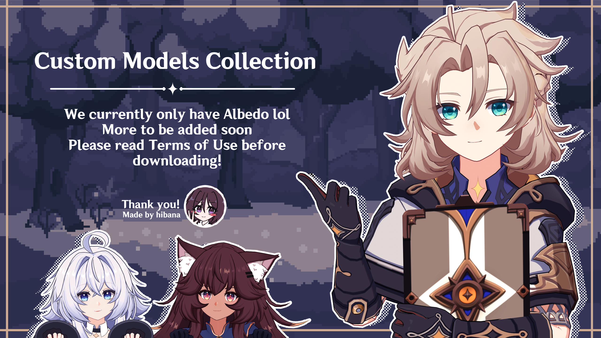

# Custom Models Collection

> [!IMPORTANT]
> All models require Goo Engine 4.1.1 or later to be properly displayed.

## Model Distribution Terms of Use

### Permitted uses

- Making and sharing renders and animations using models from this collection.
- Editing my custom assets for renders and animations.
- Modding models from this collection into game for personal use.

**Publicly shared renders and animations must include proper credit.**

### Forbidden uses

- Reuploading or sharing files and assets from this collection, even if edited or converted.
- Using the models to produce R-18 content.
- Using the models to promote hate speech or discrimination.
- Using my custom assets for AI training or modifying them with generative AI.
- Using my custom assets in non-Genshin models.
- Commercial use.

## Credits

- **HoYoverse** — Original assets
- **[hibana](https://github.com/hibanyari)** — Model modifications
- **[Mken](https://x.com/Mken_TechArt)** — Setup Wizard
- **[festivities](https://github.com/festivities)** — Shader

## Contact

For inquiries, DM **@hibanyari** on Discord.